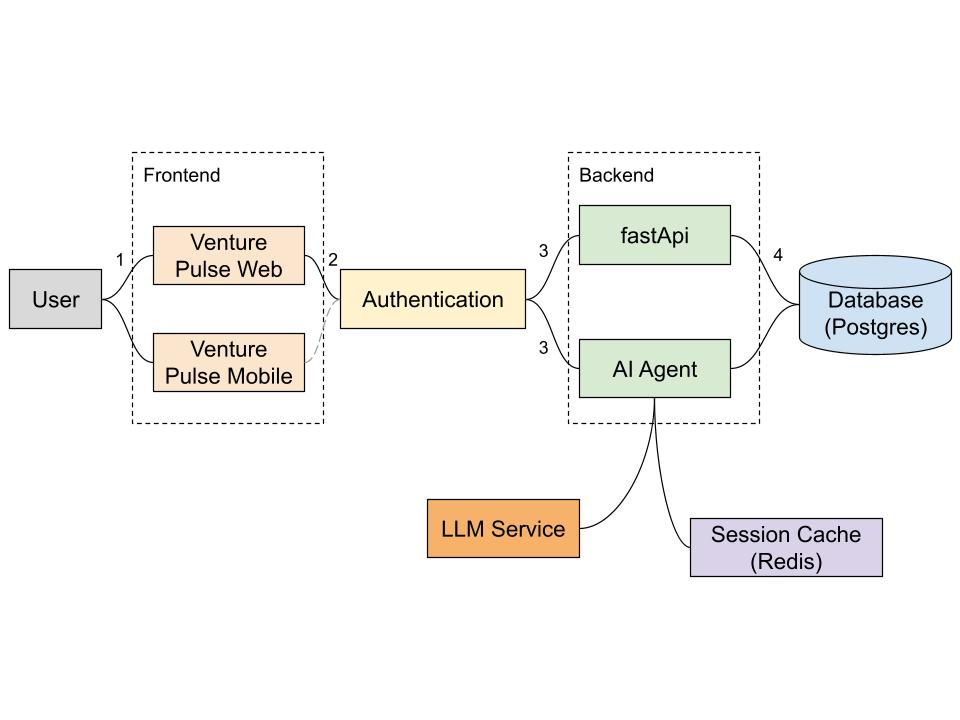

# Venture Pulse
**Portfolio Monitoring & Venture Analytics Dashboard**

Venture Pulse is a full-stack internal tool designed for venture studios to track portfolio health, monthly burn rates, and pilot customer progress. It features an AI-powered analyst to query the portfolio using natural language.

## 🌧️ Meet Mattar: The AI Analyst

The centerpiece of this prototype is **Mattar**, a custom AI analyst integrated directly into the dashboard.

Named after my last name (**Mattar**, meaning **"Rain"** in Arabic), this agent embodies the principle of nourishing an ecosystem. Just as rain brings clarity and growth to a landscape, Mattar flows through complex data to provide the Studio team with clear, actionable insights.

### Why Mattar is Different
While many AI implementations rely on heavy, "black-box" frameworks like LangChain, Mattar was built from the ground up as a **Manual ReAct (Reasoning + Acting) Agent**. This custom approach provides several key advantages for a founding-stage platform:

* **State-Aware Analysis:** Unlike basic chatbots, Mattar is aware of the dashboard's state. When you ask a question, Mattar doesn't just talk—it **acts**, filtering the venture list and updating the UI to match its findings.
* **Persistent Context:** Mattar maintains a memory of your current session. You can ask follow-up questions, and the agent will understand the context of your previous analysis.
* **Lightweight & LLM-Agnostic:** By avoiding heavy abstractions, the agent is incredibly fast and can be toggled between OpenAI, Anthropic, or local models via a single configuration change.


> *"Mattar isn't just an interface; it's designed to be the cognitive rain that turns a desert of ventures complex data into a garden of insights."*

---

## 🏗️ Architecture Overview



The system is designed as a modular, containerized microservices architecture:

* **Reverse Proxy (Nginx)**: Acts as the "Gatekeeper." It handles incoming traffic from Cloudflare, intelligently routing `/api` requests to the FastAPI backend and all other traffic to the React frontend.
* **Frontend**: Built with **React (Vite)**, **Tailwind CSS**, and **Framer Motion**. It provides a high-performance dashboard with interactive data visualizations via **Recharts**.
* **Backend (FastAPI)**: The core engine. It manages business logic, database ORM via **SQLModel**, and orchestrates the AI agent's reasoning loops.
* **AI Agent (OpenAI)**: Integrated into the backend to transform natural language queries into SQL or data insights, allowing users to "talk" to their portfolio data.
* **Database (PostgreSQL)**: The reliable "Source of Truth" for all relational portfolio data, investment rounds, and KPIs.
* **Cache/Session (Redis)**: Manages real-time chat history and temporary state to ensure fast, context-aware AI interactions.
* **Orchestration**: Docker Compose

---

## 🛠️ Setup Instructions

### 1. Prerequisites
* Docker and Docker Compose installed.
* An OpenAI API Key (required for the AI Analyst).

### 2. Environment Configuration
Create a `.env` file in the root directory:

```env
# Database
DB_USER=postgres
DB_PASS=postgres123
DB_NAME=venture_pulse
DATABASE_URL=postgresql://postgres:postgres123@db:5432/venture_pulse

# Redis
REDIS_HOST=redis
REDIS_PORT=6379
REDIS_URL=redis://redis:6379

# LLM
OPENAI_API_KEY=sk-proj-...

# JSON mapping of provider to a list of allowed models
ALLOWED_MODELS_JSON='{"openai": ["gpt-4o", "gpt-5-nano", "gpt-5.2"], "anthropic": ["claude-3-5-sonnet-20240620"], "google": ["gemini-1.5-flash"]}'
```